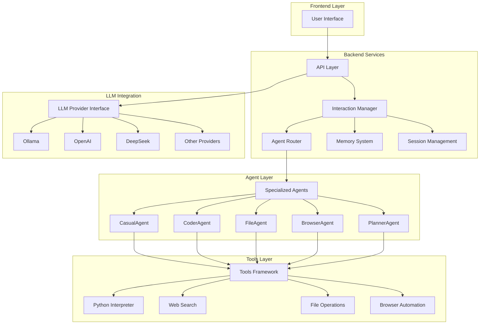
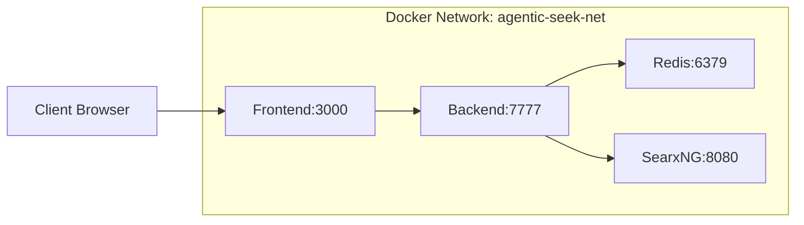

# AgenticSeek Technical Architecture

## 1. Architecture Overview

AgenticSeek is built on a modular agent-based architecture that enables extensible AI capabilities through specialized agents and tools. The system supports both local and cloud-based LLM providers with a flexible deployment model.

### 1.1 System Architecture Diagram



## 2. Technology Stack

### 2.1 Core Technologies

**Backend Services:**
- **FastAPI**: High-performance REST API framework
- **Python 3.11+**: Primary programming language
- **Pydantic**: Data validation and serialization
- **Celery**: Asynchronous task processing
- **Redis**: Task queue and caching

**Frontend:**
- **React 18**: Modern UI framework
- **Node.js**: JavaScript runtime
- **Tailwind CSS**: Utility-first CSS framework

**Infrastructure:**
- **Docker**: Containerization platform
- **Docker Compose**: Multi-container orchestration
- **SearxNG**: Privacy-focused search engine

### 2.2 LLM Integration

**Local Providers:**
- **Ollama**: Local LLM serving platform
- **LM Studio**: Local model inference

**Cloud Providers:**
- **OpenAI**: GPT series models
- **DeepSeek**: Deep reasoning models
- **Anthropic**: Claude models
- **Google**: Gemini models
- **Together AI**: Aggregated model platform
- **OpenRouter**: Multi-provider routing

## 3. Component Architecture

### 3.1 API Layer (FastAPI)

The API layer provides RESTful endpoints for client interaction and system management.

**Core Responsibilities:**
- Request validation and routing
- Response formatting and error handling
- CORS configuration for cross-origin requests
- Static file serving for screenshots

**Key Endpoints:**
- `/query`: Primary interaction endpoint
- `/health`: System health monitoring
- `/screenshot`: Browser automation results
- `/stop`: Operation cancellation

### 3.2 Interaction Manager

The interaction manager orchestrates agent selection and conversation flow.

**Core Functions:**
- Agent routing based on query analysis
- Conversation memory management
- Session persistence and recovery
- Multi-language support
- TTS/STT integration

**Implementation Details:**
```python
class Interaction:
    def __init__(self, agents: List[Agent], ...):
        self.agents = agents
        self.memory = Memory()
        self.current_agent = None
        
    async def think(self) -> bool:
        # Route to appropriate agent
        # Manage conversation flow
        # Handle tool execution
        pass
```

### 3.3 Agent Framework

All agents inherit from a base `Agent` class that provides common functionality.

**Base Agent Features:**
- LLM provider integration
- Tool execution framework
- Memory management
- Status tracking and reporting
- Error handling and recovery

**Agent Specializations:**

#### CasualAgent
- **Purpose**: General conversation and Q&A
- **Tools**: Web search, basic information retrieval
- **Memory**: Conversation history and context

#### CoderAgent
- **Purpose**: Programming and code-related tasks
- **Tools**: Multi-language interpreters (Python, JavaScript, C++, Go, Java)
- **Features**: Code execution, debugging, analysis

#### FileAgent
- **Purpose**: File system operations and management
- **Tools**: File search, read/write operations, directory traversal
- **Security**: Confined to workspace directory

#### BrowserAgent
- **Purpose**: Web automation and data extraction
- **Tools**: Selenium WebDriver, web search integration
- **Features**: Page navigation, form filling, screenshot capture

#### PlannerAgent
- **Purpose**: Complex task planning and decomposition
- **Tools**: Web search, browser automation
- **Features**: Multi-step planning, goal-oriented reasoning

### 3.4 Tools Framework

The tools framework provides a unified interface for agent capabilities.

**Tool Architecture:**
```python
class Tools(ABC):
    def __init__(self):
        self.tag = "tool_identifier"
        self.name = "Tool Name"
        self.description = "Tool description"
    
    @abstractmethod
    def execute(self, blocks: List[str], safety: bool) -> str:
        pass
    
    @abstractmethod
    def execution_failure_check(self, output: str) -> bool:
        pass
    
    @abstractmethod
    def interpreter_feedback(self, output: str) -> str:
        pass
```

**Available Tools:**

#### Code Execution Tools
- **PyInterpreter**: Python code execution with sandboxing
- **JavaScript Interpreter**: Node.js runtime integration
- **C_Interpreter**: C/C++ compilation and execution
- **GoInterpreter**: Go toolchain integration
- **JavaInterpreter**: JVM-based execution
- **BashInterpreter**: Shell script execution

#### Web Integration Tools
- **searxSearch**: Privacy-focused web search via SearxNG
- **webSearch**: Google search via SerpAPI (deprecated)
- **Browser automation**: Selenium-based web interaction

#### File System Tools
- **fileFinder**: File search and location
- **file_operations**: File manipulation and management

### 3.5 LLM Provider Interface

The provider interface abstracts different LLM services behind a unified API.

**Provider Architecture:**
```python
class Provider:
    def __init__(self, provider_name, model, server_address, is_local):
        self.available_providers = {
            "ollama": self.ollama_fn,
            "openai": self.openai_fn,
            "deepseek": self.deepseek_fn,
            # ... other providers
        }
    
    def respond(self, history, verbose=True):
        # Route to appropriate provider
        # Handle response formatting
        # Manage errors and retries
        pass
```

**Provider Integration:**
- **Local Providers**: Ollama, LM Studio with direct API calls
- **Cloud Providers**: OpenAI, Anthropic, Google with API key authentication
- **Response Processing**: Reasoning extraction, answer formatting
- **Error Handling**: Connection failures, rate limiting, model availability

## 4. Data Models

### 4.1 Request/Response Models

**QueryRequest Model:**
```python
class QueryRequest(BaseModel):
    query: str
    tts_enabled: bool = True
```

**QueryResponse Model:**
```python
class QueryResponse(BaseModel):
    done: str
    answer: str
    reasoning: str
    agent_name: str
    success: str
    blocks: dict
    status: str
    uid: str
```

### 4.2 Execution Result Model

**executorResult Model:**
```python
class executorResult:
    def __init__(self, block: str, feedback: str, success: bool, tool_type: str):
        self.block = block
        self.feedback = feedback
        self.success = success
        self.tool_type = tool_type
```

## 5. Deployment Architecture

### 5.1 Docker Deployment

**Service Composition:**
- **Redis**: Task queue and caching service
- **SearxNG**: Web search engine
- **Frontend**: React application server
- **Backend**: FastAPI application server

**Network Architecture:**


**Volume Management:**
- **Source Code**: Live reloading for development
- **Screenshots**: Browser automation results
- **Workspace**: Persistent file storage
- **Redis Data**: Persistent caching

### 5.2 CLI Deployment

**Direct Execution:**
- Python script execution
- Local LLM provider integration
- File system access
- Browser automation (optional)

**Configuration:**
- INI-based configuration
- Environment variable override
- Command-line argument support

## 6. Security Architecture

### 6.1 Code Execution Security

**Sandboxing Measures:**
- Process isolation for interpreters
- File system access restrictions
- Network access controls
- Resource usage limits

**Tool Safety:**
- Execution confirmation prompts
- Error handling and recovery
- Output validation and sanitization
- Audit logging for security events

### 6.2 API Security

**Current Limitations:**
- No authentication implemented
- Open CORS configuration
- No rate limiting
- Basic error handling

**Recommended Enhancements:**
- API key authentication
- JWT token-based sessions
- Request rate limiting
- Input validation and sanitization
- HTTPS enforcement

### 6.3 Data Protection

**Local Processing:**
- Preference for local LLM providers
- On-device computation when possible
- Minimal data transmission to cloud services

**Sensitive Data Handling:**
- API key management via environment variables
- Session data encryption
- Audit logging for compliance
- Data retention policies

## 7. Performance Architecture

### 7.1 Caching Strategy

**Redis Integration:**
- Task queue management
- Response caching
- Session storage
- Rate limiting support

**Memory Management:**
- Conversation history compression
- Tool result caching
- Browser instance pooling
- Resource cleanup on completion

### 7.2 Scalability Considerations

**Current Limitations:**
- Single-instance design
- No horizontal scaling support
- Limited concurrent processing
- Resource-intensive operations

**Future Enhancements:**
- Multi-instance deployment
- Load balancing support
- Database integration
- Microservices architecture

## 8. Monitoring and Observability

### 8.1 Logging Architecture

**Structured Logging:**
- File-based log storage
- Rotating log files
- Structured log format (JSON)
- Configurable log levels

**Log Categories:**
- System logs: Startup, configuration, errors
- Agent logs: Decision making, tool execution
- API logs: Request/response tracking
- Tool logs: Execution results and errors

### 8.2 Health Monitoring

**Health Check Endpoints:**
- System status monitoring
- Service dependency checks
- Resource usage monitoring
- Error rate tracking

**Metrics Collection:**
- Response time tracking
- Error rate monitoring
- Resource utilization
- User interaction patterns

## 9. Extensibility Architecture

### 9.1 Agent Extension

**Adding New Agents:**
1. Inherit from base `Agent` class
2. Implement required abstract methods
3. Define tool requirements
4. Configure prompt templates
5. Register with interaction manager

**Agent Plugin System:**
```python
class CustomAgent(Agent):
    def __init__(self, name, prompt_path, provider, verbose=False):
        super().__init__(name, prompt_path, provider, verbose)
        self.tools = {
            "custom_tool": CustomTool(),
        }
    
    def process(self, prompt, speech_module):
        # Custom processing logic
        pass
```

### 9.2 Tool Extension

**Adding New Tools:**
1. Inherit from base `Tools` class
2. Define tool tag and metadata
3. Implement execution logic
4. Add error handling and feedback
5. Register with appropriate agents

**Tool Plugin System:**
```python
class CustomTool(Tools):
    def __init__(self):
        super().__init__()
        self.tag = "custom_tool"
        self.name = "Custom Tool"
        self.description = "Custom tool description"
    
    def execute(self, blocks: List[str], safety: bool) -> str:
        # Custom execution logic
        pass
```

### 9.3 Provider Extension

**Adding New LLM Providers:**
1. Extend provider configuration
2. Implement provider-specific methods
3. Add authentication handling
4. Configure response processing
5. Register with provider interface

## 10. Future Architecture Considerations

### 10.1 Microservices Migration

**Service Decomposition:**
- Agent services (separate containers)
- Tool services (specialized execution)
- LLM provider services (proxy and caching)
- Frontend services (UI and API gateway)

**Benefits:**
- Independent scaling
- Technology flexibility
- Fault isolation
- Deployment flexibility

### 10.2 Database Integration

**Data Persistence:**
- Conversation history storage
- User preference management
- Analytics and metrics
- Configuration management

**Database Options:**
- PostgreSQL for relational data
- MongoDB for document storage
- Redis for caching and sessions
- InfluxDB for time-series metrics

### 10.3 Advanced Features

**Real-time Collaboration:**
- WebSocket integration
- Multi-user session support
- Real-time synchronization
- Conflict resolution

**Advanced AI Features:**
- Multi-modal processing
- Vector search integration
- Knowledge graph construction
- Reinforcement learning

This technical architecture document provides a comprehensive overview of the AgenticSeek system's design, implementation details, and future development directions. The modular architecture enables easy extension and maintenance while supporting multiple deployment scenarios.